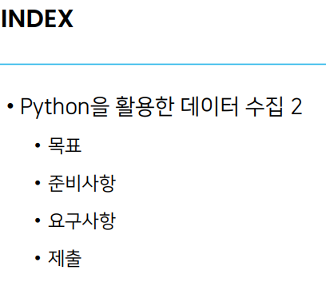
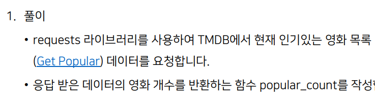
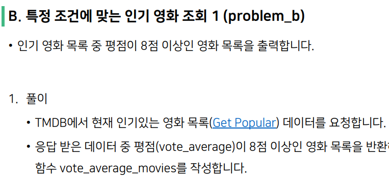
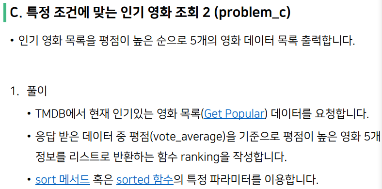
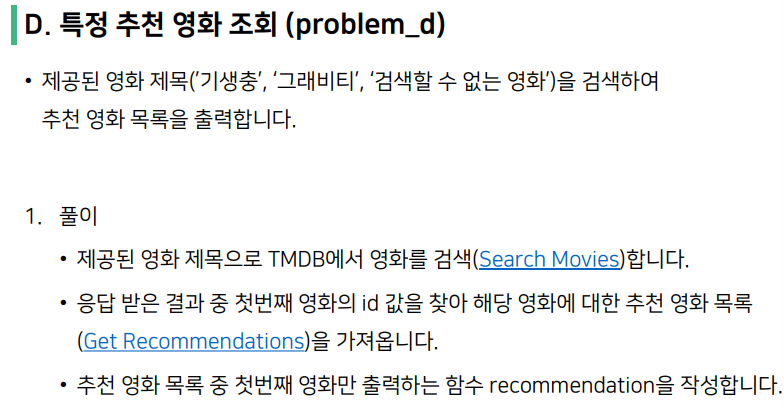
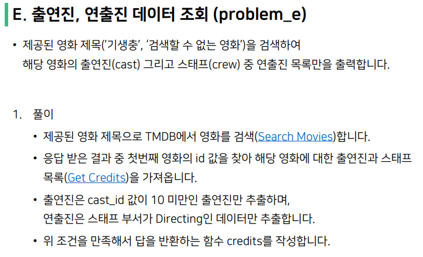

# 02 pjt




## a. 인기영화 조회



작성한 코드

```python
def popular_count():
    pass 
    # 여기에 코드를 작성합니다. to

    api_key = 'eb91384b5d1bdc5b11f6949707f5381d'
    URL = f'https://api.themoviedb.org/3/movie/popular?api_key={api_key}&language=en-US&page=1'
    response = requests.get(URL).json()
    a = response.get('results')
    return len(a) #result 리스트의 항목의 개수를 구함
```

학습한 부분 :

 api 키를 이용하는 방법과 api 불러오는 방법을 배움
 url을 사이트 어디서 불러와야하는지 몰라서 한참 헤맴
 f-string을 이용하여 url을 만드니 더 깔끔함
 .json을 이용해 json 딕셔너리 형식으로 변환



작성한 코드

```python
def vote_average_movies():
    pass 
    # 여기에 코드를 작성합니다.  
    api_key = 'eb91384b5d1bdc5b11f6949707f5381d'
    URL = f'https://api.themoviedb.org/3/movie/popular?api_key={api_key}&language=en-US&page=1'
    response = requests.get(URL).json()
    a = response.get('results') #a는 results value이고 리스트형식
    b=[]
    for i in range(len(a)):
      if a[i].get('vote_average') >= 8.0:  #a는 딕셔너리 여러개가 리스트로 들어가 있음
        b.append(a[i])             #그중 'vote_average'값이 8이상인 a안의 딕셔너리들을 b에 넣음

    return b
```

학습한 부분

변수 이름을 자꾸 a, b로 정함  다음부터는 고민해서 이름을 정하자

딕셔너리 안에 리스트 안에 딕셔너리를 건드리는데 자꾸 머리로 상상해서 풀려고함

직접 response를 보면서 풀어야 훨씬 풀기 쉬울듯, 앞으로 더 복잡한 자료구조가 있을 것이라 생각함



작성한 코드

```python
def ranking():
    pass 
    # 여기에 코드를 작성합니다.  
    api_key = 'eb91384b5d1bdc5b11f6949707f5381d'
    URL = f'https://api.themoviedb.org/3/movie/popular?api_key={api_key}&language=en-US&page=1'
    response = requests.get(URL).json()
    a = response.get('results')
    b=[]
    for i in range(len(a)):
      if a[i].get('vote_average')>0:
        b.append(a[i])      
         #b에 a의 딕셔너리들을 넣음, 굳이 할 필요 없엇..
    c = sorted(b, key = lambda a : a['vote_average'], reverse = True) # 람다함수로 vote_average값을 
                                                                      #기준으로 b를 내림차순 정렬


    return c[:5]
```

학습한 부분

람다함수 아주 편하다 아직 익숙하지 않지만 계속 연습하도록

b를 만들 때 굳이 쓸모없는 코드를 만듬



작성한 코드

```python
def recommendation(title):
    pass 
    # 여기에 코드를 작성합니다.  
    api_key = 'eb91384b5d1bdc5b11f6949707f5381d'
    t = title
    URL = f'https://api.themoviedb.org/3/search/movie?api_key={api_key}&language=ko&page=1&query={t}'
    response = requests.get(URL).json()
    #pprint(response)
    if bool(response.get('results')) == False : #response result값이 []라면 
        return None                             #none 반환

    elif bool(response.get('results')) == True : # elif 
        movie_id = response.get('results')[0].get('id') #response의 results가 존재하고 
                                                         #첫번째 영화의 아이디 값을 구함
        rec_url = f'https://api.themoviedb.org/3/movie/{movie_id}/recommendations?api_key={api_key}&language=ko&page=1'
        res = requests.get(rec_url).json() # id 값과 관련된 영화 추천
        

        if bool(res['results']) == True:  #추천영화가 있다면
            a=[]                                 #a에 제목을 담는다
            for i in range(len(res['results'])):
                a.append(res['results'][i].get('title'))
            return a
    
        elif bool(res['results']) == False: #추천이 없으면
            return []                        # []을 뱉는다
```

학습한 내용

bool을 이용하여 경우의 수를 나눔

results를 result라 써서 시간을 엄청 씀

이런 것도 많이 하다보면 금방 찾겠지



작성된 코드

```python
def credits(title):
    pass 
    # 여기에 코드를 작성합니다.  
    api_key = 'eb91384b5d1bdc5b11f6949707f5381d'
    t = title
    URL = f'https://api.themoviedb.org/3/search/movie?api_key={api_key}&language=ko&page=1&query={t}'
    response = requests.get(URL).json()
    #pprint(response)
    if bool(response.get('results')) == False : 
        return None         #results가 없으면 None

    elif bool(response.get('results')) == True :  #result 있으면 
        movie_id = response.get('results')[0].get('id') #id 값 추출
   
        rec_url = f'https://api.themoviedb.org/3/movie/{movie_id}/credits?api_key={api_key}&language=ko'
        res = requests.get(rec_url).json() #무비크레딧 뽑음

        casting = []
        for i in range(len(res['cast'])):     
            if res['cast'][i]['cast_id'] < 10: #cast의 cast_id가 10보다 작으면
                casting.append(res['cast'][i]['name'])  #이름을 casting에 넣음

        direct = []
        for i in range(len(res['crew'])):       
            if res['crew'][i]['department'] == 'Directing': #crew 가 Directing소속이면
                direct.append(res['crew'][i]['name'])  #이름을 direct에 넣는다
        
        return {'cast' : casting, 'directing' : direct}
```

학습한 것

딕셔너리 안에 여러가지 키값이 들어가고 데이터가 크면 .keys를 통해 먼저 키를 뽑고 eda를 잘해야 문제 푸는데 수월함

crew 와 cast, department 등의 키를 잘 구분하여 데이터를 추출해야 함 오래동안 헤맴
